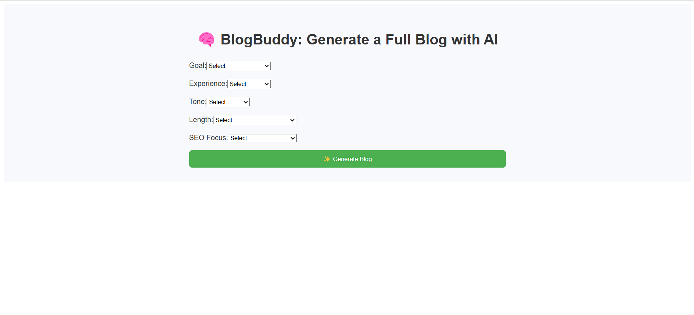
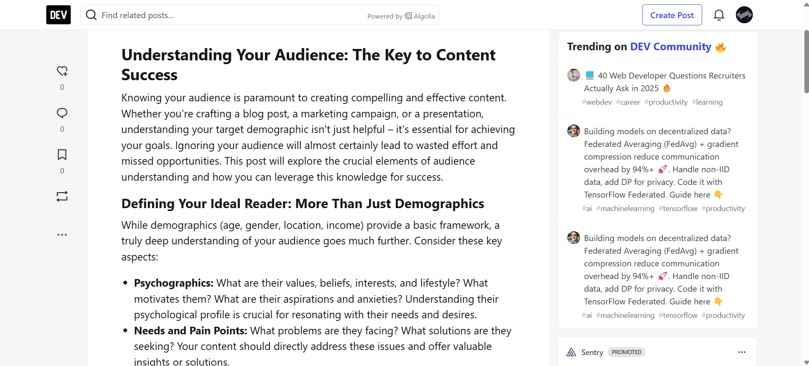

# BlogBuddy 📝✨
 
[](https://github.com/MeetDesai21/blogbuddy/stargazers) [](https://github.com/MeetDesai21/blogbuddy/network) [](https://github.com/MeetDesai21/blogbuddy/issues)   
 
BlogBuddy is a streamlined blogging platform designed to help writers and content creators manage their content more efficiently. Built with JavaScript, CSS, and HTML, it provides a user-friendly interface for creating, editing, and publishing blogs with ease. This project aims to simplify the blogging process, making it accessible for both beginners and experienced users.
 
## Features 🚀
 
- **User Authentication**: Secure user registration and login system.
- **Content Management**: Create, edit, and delete blog posts.
- **Rich Text Editor**: Write and format your blogs with a simple and intuitive editor.
- **Responsive Design**: Fully responsive design that works on all devices.
- **Commenting System**: Allow readers to engage with your content through comments.
- **SEO Friendly**: Optimize your blogs for search engines.
 
## Requirements and Prerequisites
 
Before you begin, ensure you have the following installed on your machine:
 
- Node.js
- npm (Node Package Manager)
- A web server (e.g., Apache, Nginx)
 
## Installation 🛠️
 
1. **Clone the repository**:
    ```sh
    git clone https://github.com/MeetDesai21/blogbuddy.git
    cd blogbuddy
    ```
 
2. **Install backend dependencies**:
    ```sh
    cd backend
    npm install
    ```
 
3. **Install frontend dependencies**:
    ```sh
    cd ../frontend
    npm install
    ```
 
4. **Set up environment variables**:
    Create a `.env` file in the `backend` directory and add your configuration variables, such as database URLs and API keys.
 
5. **Run the backend server**:
    ```sh
    cd backend
    npm start
    ```
 
6. **Run the frontend server**:
    ```sh
    cd ../frontend
    npm start
    ```
 
## Usage 📚
 
### Starting the Application
 
To start the application, follow these steps:
 
1. **Backend**:
    ```sh
    cd backend
    npm start
    ```
 
2. **Frontend**:
    ```sh
    cd frontend
    npm start
    ```
 
### Creating a Blog Post
 
1. Navigate to the blog creation page.
2. Fill in the title, content, and other details.
3. Click the "Publish" button to save your blog post.
 
### Editing a Blog Post
 
1. Navigate to the list of blog posts.
2. Click on the post you wish to edit.
3. Make the necessary changes and click the "Save" button.
 
## Screenshots/Demo 📸
 
Add screenshots or GIFs of the application in action here. You can use placeholders like:
 
- 
- 
- 
 
## Testing Instructions 🛠️
 
To run the tests, use the following commands:
 
1. **Backend Tests**:
    ```sh
    cd backend
    npm test
    ```
 
2. **Frontend Tests**:
    ```sh
    cd frontend
    npm test
    ```
 
## Roadmap/Future Enhancements 🌟
 
- [ ] Implement advanced text formatting options.
- [ ] Add social media sharing features.
- [ ] Integrate with third-party services for better analytics.
- [ ] Improve SEO and accessibility features.
- [ ] Mobile app development for Android and iOS.
 
## Contributing Guidelines ❤️
 
We welcome contributions from the community! Please follow these steps:
 
1. Fork the repository.
2. Create a new branch for your feature or bug fix.
3. Commit your changes with descriptive messages.
4. Push your changes to your fork.
5. Submit a pull request to the main repository.
 
## Acknowledgements 🙏
 
- **MeetDesai21** - Project Creator and Maintainer
 
## License Information 📜
 
This project is currently not licensed. For more information, please check the LICENSE file.
